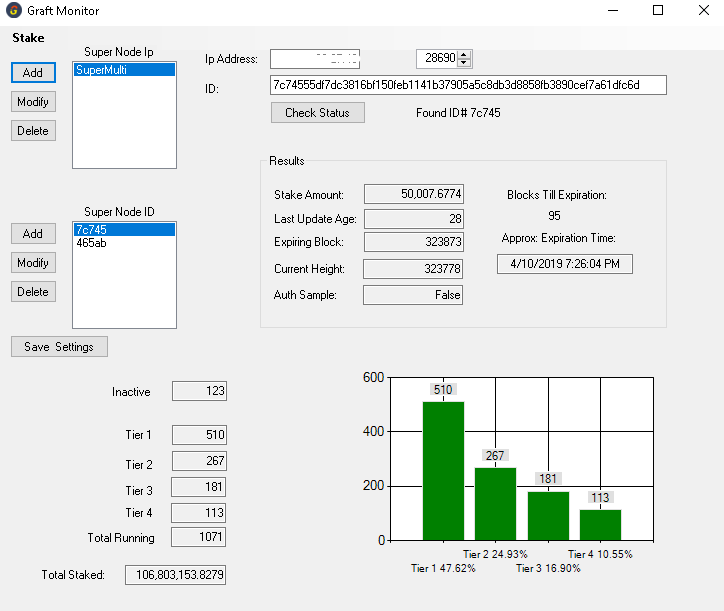
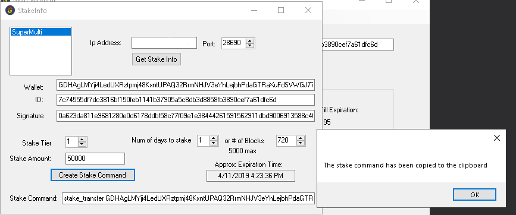

# graft-sn-monitor

I created this program to help myself and a few friends keep an eye on our supernodes.
I'm not a "dev", just a weekend warrrior, as you can tell, that's why it's in VB.NET.   

Basically it's just an interface for querying http://Your_Server_IP:Supernode_Port/debug/supernode_list/1 supdernode status and  http://Your_Server_IP:Supernode_port/dapi/v2.0/cryptonode/getwalletaddress
for stake info, which helps with the creation of the stake_transfer command.

Here is a youtube video showing the basics https://youtu.be/iisYxumTmD4.

## Supernode Info
.Net 4.6 or higher is required. 
Extract the zip File. Run the graft-monitor.exe.

Click the Add button for Super Node Ip, Enter a name such as Supernode1, Ip address, set the port and click Save.
The port will be whatever you have set as "http-address=0.0.0.0:18690" in the config.ini. Usually 18690 or 28690.
Add as many supernode IPs as you want. If you run multiple on 1 server, you can just set the IP and port of the first one, then just use the up-down for port settings.

Click the Add button for Super Node ID, Enter a name, I use the first 5 characters of the ID, Paste in your Supernode ID, then click Save.
Again, add as many Supernode IDs as you like.

Now click Save Settings.  This will save the IP info and Supernode Id info to a config file name "multi.json".

Highlight the Supernode IP and SuperNode ID you want to query.  The Ip address, port, and ID should change accordingly.

Click Check Status.
If the IP info is correct and Supernode is running, you should get results back.  If the IP info is incorrect or Supernode is down, it should return an error after a few seconds.  

Compare the current height that your supernode reports to the height on the block explorer, if your's is lower, then your graftnoded is out of sync.

## Stake Info

To get stake information, click the Stake button in the upper left corner.

If you have multiple supernodes in the list, click the desired one, verify IP address and port are correct then click "Get Stake Info".

You can copy the Wallet, ID and Signature out to create your own command or select the tier\enter stake amount, select number of days to stake or select the exact number of blocks so that it expires at a convenent day\time for you, then click "Create Stake Command".

Notice, the "Approx expiration time" is an approximation based on 2 minute block time, it also could change depending on how long your transaction sits int the transaction pool.

The command will be copied to the clipboard and also into the textbox labeled "Stake Command:".

If compiling yourself, you may have to use NuGet to install "Newtonsoft.Json" to the project.

Donations welcome :)

Graft: G5LKkC6cZQBfTQohpMrBSqC1hweeC1KGP9kWvMkTFKJzJaPuRPEKwrof4QTU4m4ZZSjZ5oGwPB3k8aE1X8Ud1Z59HU1gxxe
Bitcoin: 1GUrf5Y3JSmZYCeuK46ngSQkCHsbWHqbVJ

